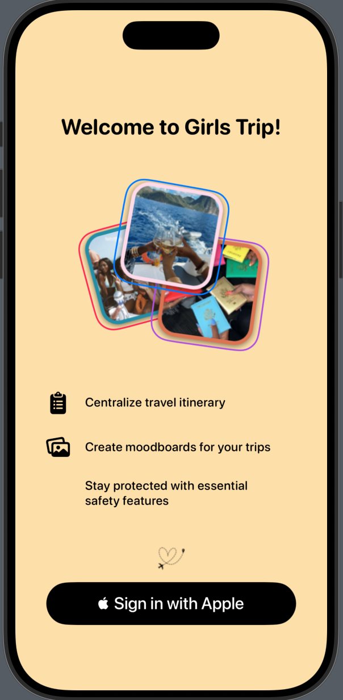
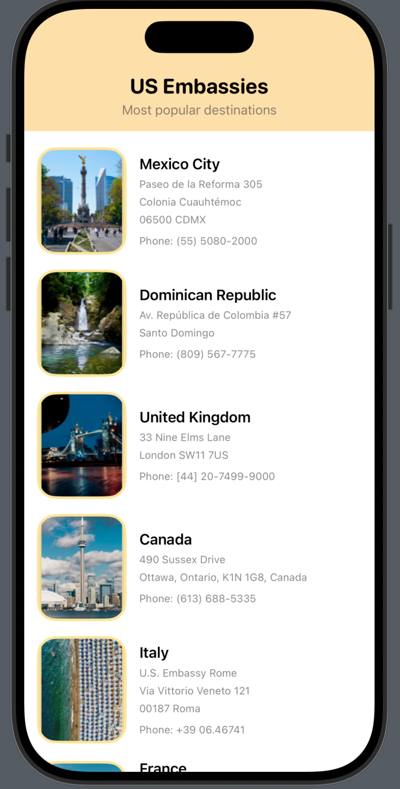

# Girls Trip

An all-in-one SwiftUI travel companion for planning, safety, and on-device translation. Walk through a beautiful onboarding flow, manage your profile and medical data, get essential embassy info, and translate on the fly—all in one place.

---

## Features

- **Splash Screen** with full-screen background and centered logo
- **Onboarding Flow**
  - Welcome screen with photo collage & feature highlights
  - Sign In with Apple
  - Profile setup (name, emergency contact, passport)
  - Final setup instructions (Health app Medical ID)
  - Permissions priming (Location Services)
- **Tab-based Main Interface**
  - Home: Search bar, “Create a trip” prompt, moodboards carousel, Safety Hub shortcuts
  - #OOTD, Import, Map & Profile placeholder tabs
- **Safety Hub**
  - US Embassies list with images & addresses
  - STEP Enrollment instructions
  - Translator: on-device async translation (iOS 18+)
- **Design**
  - Modern SwiftUI look
  - Soft pastel palette (peach & yellow accents)
  - Rounded cards, dashed outlines, capsule buttons
  - Custom tab-bar colors

---

## Screenshots

<div align="center">
   
   
   
   
   
   
   
   
   
</div>

---

## Requirements

- **Xcode 15+**
- **iOS 18+** (on-device translation)
- **Swift 5.9+**
- **SwiftUI**

---

## Installation

1. **Clone**
   ```bash
   git clone https://github.com/yourusername/Girls_Trip.git
   cd Girls_Trip
   ```
2. **Open** `Girls_Trip.xcodeproj` in Xcode
3. **Ensure** all assets are in `Assets.xcassets`
4. **Run** (⌘R) on your simulator or device

---

## Usage

- On launch you’ll see the **Splash** screen.
- Tap **Sign in with Apple** ➡️ complete onboarding steps.
- Grant location in the **Permissions** primer.
- Explore the **Home** tab:
  - Use the **Search** bar
  - Tap **Create a trip** to add travel details
  - Swipe **Moodboards**
  - Tap a **Safety Hub** card to view:
    - **Embassies**
    - **STEP Enrollment**
    - **Translator**
- Switch tabs for #OOTD, Import, Map & Profile.

---

## Project Structure

```
Girls_Trip/
├─ Assets.xcassets/
│   └─ (all images & logos)
├─ ContentView.swift        # TabView & HomeView
├─ SplashScreenView.swift
├─ OnboardingView.swift
├─ ProfileSetupView.swift
├─ FinalSetupInstructionsView.swift
├─ PermissionsPrimingView.swift
├─ EmbassiesView.swift
├─ STEPEnrollmentView.swift
├─ TranslatorView.swift
├─ TranslationInterfaceView.swift
├─ PhotoCaptureView.swift
└─ Girls_TripApp.swift      # @main entry
```

---

## Credits

- On-device translation by Apple’s **Translation** framework
- Sign In with Apple via **AuthenticationServices**
- Icons from **SF Symbols**
- Placeholder photos sourced from Unsplash

---

## License

Distributed under the **MIT License**. See [LICENSE](LICENSE) for details.
